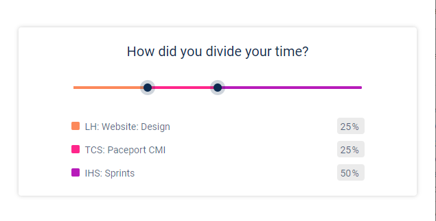

<h1 align="center">LH Time tracker</h1>
<div align="center">
  <h3>
    <a href="https://github.com/Betsimisaraka/lh-time-tracker">
      Source
    </a>
    <span> | </span>
    <a href="https://lh-time-tracker.netlify.app/">
      Demo
    </a>
  </h3>
</div>
<br/>

A multi-range slider and value display component to determine how you divide your time.


### Build with

- [React](https://reactjs.org/)
- [React-Redux](https://react-redux.js.org/)
- [HTML5](https://html.org/)
- [CSS](https://css.org)

### Functionality

- There are two slider thumbs.
- There are 3 input fields displaying each value as a percentage.
- When the slider thumbs are dragged the percentage values are updated.
- When the values in the input fields change, the slider thumb positions also change in accordiance with those changed values.

### How to use

To clone and run this application, you'll need [Git](https://git-scm.com), [Node.js](https://nodejs.org/en/download/) (which comes with [npm](http://npmjs.com)) and [parcel bundler](https://parceljs.org/getting_started.html) installed on your computer. Or you can run this with a live server. From your command line:

```bash
# Clone this repository
$ git clone https://github.com/Betsimisaraka/lh-time-tracker
# Install dependencies
$ npm install
# Run the app
$ npm run start
```

### Design

Design was provided by this [Figma](https://www.figma.com/file/6FjQW1TqHZBy38Jh567a8K/?node-id=81%3A2) file.

### Development Notes

- This project uses 2 React components:
  - The `InputRange` component is used to display the range slider with 2 thumbs.
  - `InputFields` component displays 3 fields with a label and a percentage value displayed for each field.
- Redux is used to store and share the values of the 3 fields across the 2 components.
- The Figma design included `Sailec` typography. I used `Roboto` instead to save on cost.

### Contact

GitHub [Betsimisaka](https://{github.com/Betsimisaraka})
